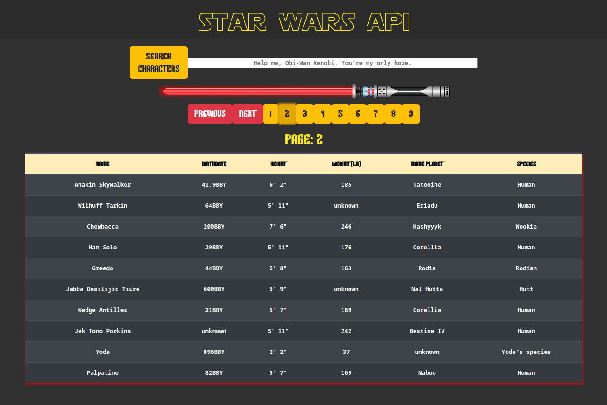

# Star Wars API React App

> A React app built using data from the swapi.dev api

  

Check out the app [HERE](https://bb-star-wars-api.herokuapp.com/)!

## Summary

I built this app to dive deeper into learning the React front end framework and to work with external api data. There were a lot of new things to tackle in this project. I am starting to build tougher applications that are a bit closer to real world projects. I know this isn't a massive project, but being comfortable with http protocol is something that is going to be invaluable in the future.

Up to this point the projects I have worked on have been using static data or data that has been provided by the user. This application was a great opportunity to look deeper into how the web works. Building this project was also a chance to continue to practice working with react. I wanted to try to learn as much new things as possible, which is why I chose to use only functional components with React Hooks.

Specific things I used and learned while building this application:

> React Hooks including useState & useEffect

> Using Postman during the build process to validate http requests

> API calls to swapi.dev to get up to date information

> Using the Axios library

> Styling React with Bootstrap 4

> Deployment to Heroku

## Author

### Brian Bastanza- Full Stack Web Developer

<a href="https://www.brianbastanza.me/" target="_blank" rel="noopener">Personal Website</a>

[LinkedIn](www.linkedin.com/in/brian-bastanza-9035397b)
